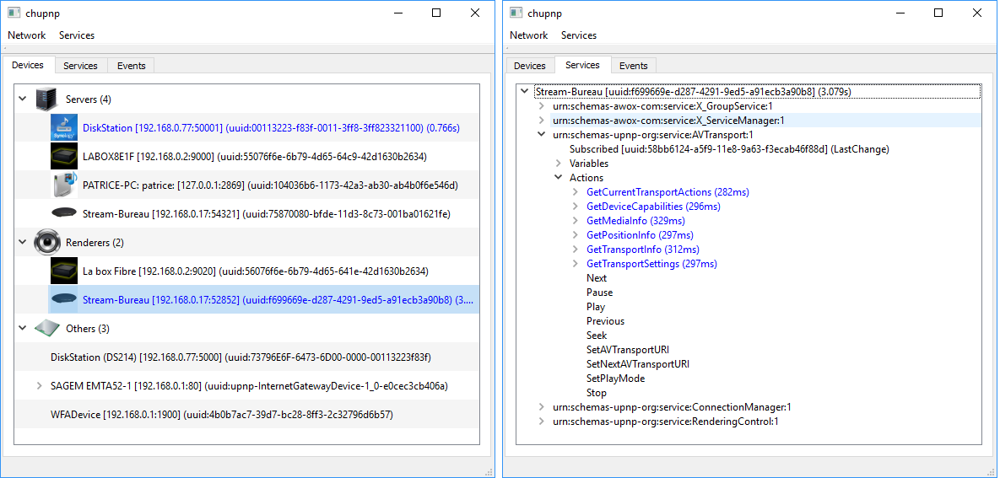
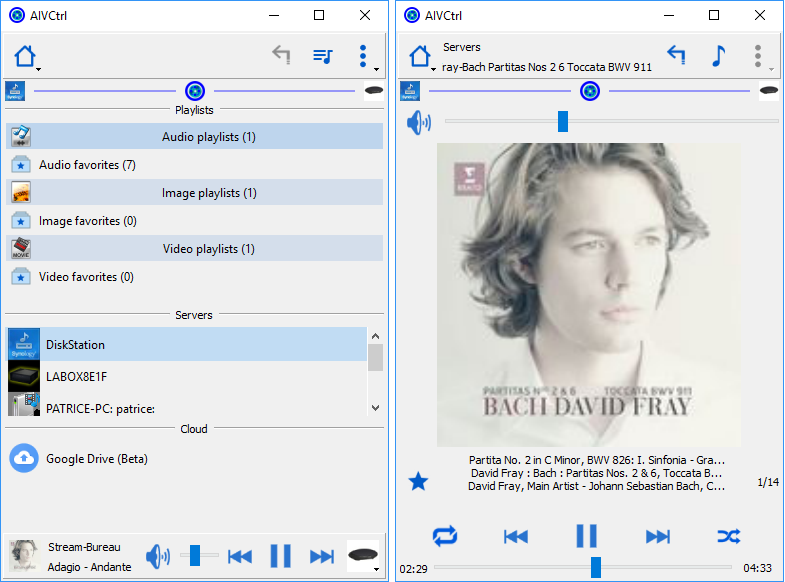

QtUPnP framework is a C++ framework, based on QT5, to build easily an UPnP control point.
It focuses on the UPnP/AV standards.
For this, a set of classes are created to handle easily media servers and media renderers and to hide the UPnP protocol.
Of course UPnP protocol (UPnP/AV use UPnP) is implemented and your can handle every compatible devices.

For a better description, unzip /upnp/docs/html.zip and choose index.html.

Build the framework and the test program need to install QT5. QtUPnP has been coded from:
  - Windows "qt-opensource-windows-x86-mingw530-5.8.0.exe" installer download from https://download.qt.io/official_releases/qt/5.8/5.8.0/.
    A 32 bits is built. It runs from Windows 7 to Windows 10 32 or 64 bits. 
    Do not forget to add to the path (global or QtCreator) the access to qtupnp.dll or change qtupnp library by a static library.

  - Linux "qt-opensource-linux-x64-5.8.0.run" installer download from https://download.qt.io/official_releases/qt/5.8/5.8.0/.
    A 64 bits is built. It has been tested on Kubuntu under VirtualBox and Ubuntu native.
    The actual pro file creates a static library.
	To build QtUPnP without QtCreator, see linux-build folder (including Raspbian build).
	
  - MacOS Several users have built QtUPnP from the actual source code.
  
  - Raspbian QtUPnP can be built using QT5.7 available in standard packages.
    To build QtUPnP install QT5.7 and QtCreator on your Raspberry PI3.
	  * sudo apt-get install qt5-default
      * sudo apt-get install qtcreator
	  
	For me it worked but another solution is possible.
	
	  * sudo apt-get update
      * sudo apt-get upgrade
      * sudo apt-get install qtcreator gcc qtbase5-dev
	  
    It has been tested under Raspbian Stretch with desktop on a Raspberry PI3.

The framework use only QT API, no other system dependent API.

The folder upnp contains the framework to encapsulate the UPnP protocol.

*************** chupnp *******************

chupnp is an application for developers to test the framework. You can see the documentation at /QtUPnP/chupnp/docs/Test QtUPnP with chupnp.pdf
The main functionalities are:
  - Discover devices
  - Choose devices.
  - Invoke the actions.
  - and see the detailed results.
  - ...
  
  
*************** AIVCtrl *******************

aivctrl is a control point for users to drive media servers and media renderers. The user documentation it in /QtUPnP/aivctrl/doc
The main fonctionnalities are:
  - A remote control format (small size on the screen).
  - Discover and show servers and renderers.
  - Browse the servers content.
  - Manage renderers like a player (volume, seek, mute, suffle, repeat, cover, previous, next...).
  - Manage audio, image, video playlists and favorites.
  - Verify playlist elements.
  - And a lot of another things.
  
To test easily AIVCtrl, some installers are available at: https://drive.google.com/drive/folders/1buJLY6XTpp-wZo90_Iixgs8oof-Ij1yu?usp=sharing
  - Windows 7 to 10: Download install-AIVCtrl-1.1.2.exe and double click on it to install.
    Tested with Windows 10. To use Vista the application must be rebuilt with Qt 5.6.
	
  - Kubuntu and Ubuntu x86: Download aivctrl-1.1.2.deb double click on it to install.
    Tested with Kubuntu 17.10, and Ubuntu 16.04 LTS (for this, use preferably /user/share/aivctrl/aivctrl.run.desktop to launch AIVCtrl).
	
  - All Linux x86: Download aivctrl-1.1.2.zip for a manual installation.
    Not tested (for this, use preferably /user/share/aivctrl/aivctrl.run.desktop to launch AIVCtrl).
	
  - Raspbian: Download aivctrl-pi3-1.1.2.deb. See raspberry-pi3-installation-notes.txt at the same https address.
      Tested on Raspberry PI3 with Raspbian Stretch.
    You can also install manually using aivctrl-pi3-1.1.2.zip. Just unpack in a folder after install qt5. 
	
  - Documentation in English and French.
  
Some hardware or software devices are tested :
  
 Hardware servers

    - NAS Synology DS214 (DSM 6).
	- NAS Synology DS213. (1)
    - NAS Western Digital My Cloud. (1)
    - Cabasse Stream 1 v17.01.5.
    - La Box Numericable.
    - FreeBox Revolution. (1)
 
 Software servers

    - Windows Media Player v12.015063.608 (Windows).
    - Foobar 2000 v1.3.16 with UPnP/DLNA Renderer, Server, Control Point plugin v0.99.49(Windows).
    - StriimServer Awox v1.2.0.0 (Windows).
    - MediaMonkey Windows v4.1.19 (Windows).
    - MediaTomb v0.12.2 (Linux).
	- MiniDLNA  on Raspberry Pi 2, LEDE/OpenWRT, Linux (1).

 Harware renderers

    Cabasse Stream 1 v17.01.5.
    La Box Numericable.
    Some televisions Samsung, Sony, LG. (1)
    Denon AVR-X2100W Amplifier. (1)
	GGMM E5 (es-100). (1)
	Naim NAC-N 272. (1)

 Software renderers

    Renderer Android Awox v2.3.0 (Android).
    BubbleUPnP v2.8.14 (Android).
    Foobar 2000 v1.3.16 with UPnP/DLNA Renderer, Server, Control Point plugin v0.99.49 (Windows).
    Windows Media Player v12.015063.608 (Windows)
	
 Router	detected
 
 	TPLink N600 Router. (1)
	Box Numericable.
	SuperHub 3 router from Virgin ISP. (1)
	
 Over devices detected

    Wemo Wi-Fi Smart Light Switch F7C030fc. (1)
	Wemo Switch Smart Plug F7C027fc. (1)
	
  (1) Tested by users. Many thanks for your contribution and your help.

If you have some free time to test or use AIVCtrl and chupnp, please use the issues tab for your remarks, malfunctions
and also to report if your servers, renderers and other devices are working or not working properly.

